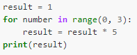

## Exercise 4.1 Computing powers with loops
Exponentiation is built into Python:
``` 5 ** 3``` gives `125`

Can you write a loop that would do the same? You may want to use `range`

<details>
<summary>Solution
</summary>



