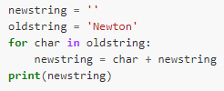

## Exercise 4.2 Reverse a string
Two strings can be concatenated using `+` e.g. `'take' + 'away'` would give `'takeaway'`. Write a loop that takes a string and produces a new string with the characters in reverse order so `Newton` becomes `notweN`.

Hint: create two variables, one for the new string and one for the original. Concatenating adds onto the end of the string, so plan ahead what order you want to add characters from the original string to the new one.

Solution

[Episode 5 exercise 1](episode5_ex1.md)
