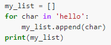

## Exercise 5.1 Turn a string into a list
Use a for-loop to convert the string `hello` into a list of letters  `['h', 'e', 'l', 'l', 'o']`

Hint: Before your for loop, create an empty list to add characters to like this: `my_list = []`

Solution

[Episode 5 exercise 2](episode5_ex2.md)
