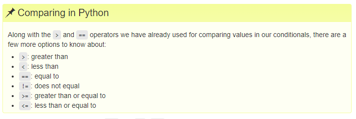

## Exercise 5.3 Non-continuous slices
You can include a third argument inside the square brackets to set the step size and only take every nth element from the list.

```python
primes = [2, 3, 5, 7, 11, 13, 17, 19, 23, 29, 31, 37]
subset = primes[0:12:3]
print('subset', subset)
```

```python
subset [2, 7, 17, 29]
```

How would you get every other element, starting from the second element? i.e.  `subset [3, 7, 13, 19, 29, 37]`

<details>
<summary>Solution
</summary>
primes[1::2]
</details>

<br>
<br>
<br>
<br>



