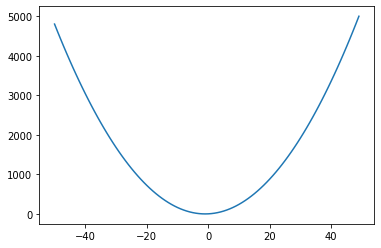
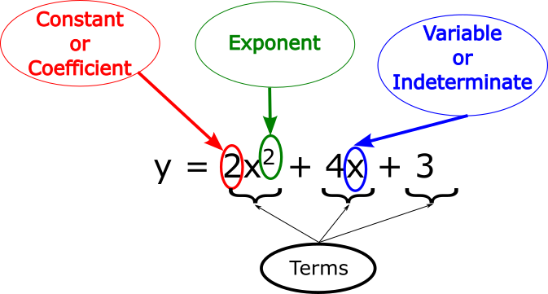

## Polynomial

### What is a polynomial

According to Wikipedia:

In mathematics, a polynomial is an expression consisting of indeterminates (also called variables) and coefficients, that involves only the operations of addition, subtraction, multiplication, and non-negative integer exponentiation of variables. An example of a polynomial of a single indeterminate x is <code>3x<sup>3</sup> + x<sup>2</sup> − 4x + 7</code>. 

For the non-mathy people (like me who need detail): <code>3x<sup>3</sup> + x<sup>2</sup> − 4x<sup>1</sup> + 7x<sup>0</sup></code>. Mathematicians know that <code>x<sup>1</sup> = x</code> (pronounced as x to the power of 1) and <code>x<sup>0</sup> = 1</code> (pronounced as x to the power of 0) which is why they shorten it to the expression as given in the first instance. The 1 and the 0 (the power to which the x is raised) is called the exponent.

The results of an equation like this can be drawn as a graph:



The ```x```, in the expression, is called a variable and the number in front of the variable is called a constant or coefficient.



If our expression is:

<code>y = 2x<sup>2</sup> + 4x + 3</code>

or, if extended:

<code>y = 2x<sup>2</sup> + 4x<sup>1</sup> + 3x<sup>0</sup></code>

then we can define it in Python as follows:

```python
x = 5
coefs = [2, 4, 3]
y = coefs[0] * x**2 + coefs[1] * x**1 + coefs[2] * x**0
print(y)
```

In this exercise we want you to replace the third line of the above program with a for-loop. 


### Hint
The built-in function enumerate takes a sequence (e.g. a list) and generates a new sequence of the same length. Each element of the new sequence is a pair composed of the index (0, 1, 2,…) and the value from the original sequence:

```python
for idx, val in enumerate(a_list):
  # Do something using idx and val
```


<details>
<summary>
   Solution
</summary>

<pre>
x=5
coeffs = [2,4,3]
y = 0;
for idx,val in enumerate(coeffs):
    y = y + coeffs[idx] * x ** idx
print(y)
    
</pre>
            
</details>
        
What would be the advantage of using a for-loop?

[Episode 6 Exercise 1](episode6_ex1.md)
